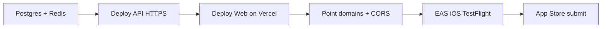

# Deployment guide — Sen

How to publish **backend**, **web**, and **iOS** for this monorepo.  
Local/dev workflows stay in [RUNNING.md](./RUNNING.md).

---

## Recommended production stack

| Layer | What you ship | Suggested host (MVP-friendly) | Alternative |
|-------|---------------|-------------------------------|-------------|
| **Data** | PostgreSQL 16 + Redis 7 | Managed Postgres (Neon / Railway / RDS) + Upstash Redis | Same VPS as API via Docker |
| **Backend** | Spring Boot JAR (`services/api`) | **Fly.io** or **Railway** (Docker) | DigitalOcean Droplet / AWS ECS |
| **Web** | Next.js (`apps/web`) | **Vercel** | Cloudflare Pages / same Docker host |
| **iOS** | Expo app (`apps/mobile`) | **EAS Build** → **App Store Connect** | TestFlight first |
| **Android** (same codebase) | Expo | EAS Build → Play Console | After iOS MVP |

```
Users
  ├─ Browser ──► Vercel (Next.js) ──/api/proxy──► API
  └─ iPhone  ──► App Store build ──HTTPS───────► API
                                              │
                              ┌───────────────┴───────────────┐
                              │  API (Docker / Fly / Railway)  │
                              │  Spring Boot :8080             │
                              └───────┬───────────────┬───────┘
                                      ▼               ▼
                                 PostgreSQL         Redis
```

**Why this split:** Next.js is easiest on Vercel; the API already has a `Dockerfile`; mobile should talk to a public HTTPS API URL, not your laptop.

---

## 0. Before anything public

1. Buy/use a domain (e.g. `sen.app`) and plan hostnames:
   - `https://sen.app` or `https://www.sen.app` → web  
   - `https://api.sen.app` → backend  
2. Generate a strong `JWT_SECRET` (≥ 32 random chars).  
3. Use real DB passwords (never commit them).  
4. Set `CORS_ORIGINS` to your real web origin(s), e.g. `https://sen.app,https://www.sen.app`.

---

## 1. Backend (Spring Boot)

### What to deploy

- Image from `services/api/Dockerfile` (JDK 21 build → JRE run)
- Env vars (see `services/api/.env.example`):

| Variable | Production notes |
|----------|------------------|
| `DB_HOST` / `DB_PORT` / `DB_NAME` / `DB_USER` / `DB_PASSWORD` | Managed Postgres |
| `JWT_SECRET` | Unique secret per environment |
| `CORS_ORIGINS` | Production web URL(s) |
| Redis | Wire when notification worker lands; compose already expects Redis locally |

Flyway migrations run on API startup — keep Postgres reachable before the first boot.

### Option A — Fly.io (Docker)

```bash
cd services/api
fly launch --name sen-api   # first time; attach Postgres (or use external)
fly secrets set JWT_SECRET='…' DB_HOST='…' DB_PASSWORD='…' CORS_ORIGINS='https://sen.app'
fly deploy
```

Health check: `GET https://api.sen.app/actuator/health` → `UP`.

### Option B — Railway / Render

- New service from repo, root `services/api`, Dockerfile deploy  
- Attach Postgres plugin or external DB  
- Set the same env vars  
- Public HTTPS URL → map custom domain `api.sen.app`

### Option C — Single VPS (closest to repo today)

```bash
# on the server
git clone … && cd sen
# edit compose / env for production secrets
docker compose --profile full up -d --build
```

Put **Caddy** or **Nginx** in front with TLS for `api.` and optionally `www.`. Fine for early MVP; move to managed hosts when you outgrow one box.

### Smoke test

```bash
curl -s https://api.sen.app/actuator/health

curl -s -X POST https://api.sen.app/api/v1/auth/register \
  -H 'Content-Type: application/json' \
  -d '{"email":"you@example.com","password":"password123","displayName":"You"}'
```

---

## 2. Web (Next.js) — public site + `/app`

### What to deploy

- App Router app in `apps/web`
- Env (see `apps/web/.env.example`):

| Variable | Production value |
|----------|------------------|
| `API_URL` | Internal/server URL to API, e.g. `https://api.sen.app` (used by `/api/proxy`) |
| `NEXT_PUBLIC_API_URL` | Keep `/api/proxy` so the browser stays same-origin |

Browser → `sen.app/api/proxy/...` → Next server → `API_URL/api/v1/...`

### Option A — Vercel (recommended)

1. Import the GitHub repo in Vercel.  
2. **Root Directory:** `apps/web`  
3. Framework: Next.js (auto).  
4. Environment variables: `API_URL`, `NEXT_PUBLIC_API_URL=/api/proxy`.  
5. Domain: `sen.app` / `www.sen.app`.

```bash
# or CLI
cd apps/web
npx vercel --prod
```

### Option B — Docker (already in repo)

`apps/web/Dockerfile` + compose `web` service. Point DNS at the host and set:

```env
API_URL=https://api.sen.app
NEXT_PUBLIC_API_URL=/api/proxy
```

### After deploy checklist

- [ ] Landing `/` loads  
- [ ] Register / login works  
- [ ] `/app` calendar & reminders call API without CORS errors  
- [ ] EN \| VI toggle works  

---

## 3. iOS (Expo → App Store)

Mobile is **not** Dockerized. Use **Expo Application Services (EAS)**.

### One-time setup

1. Apple Developer Program account (~$99/year).  
2. Bundle ID already in `apps/mobile/app.json`: `app.sen.lunar`.  
3. Install EAS CLI and log in:

```bash
npm i -g eas-cli
cd apps/mobile
eas login
eas build:configure
```

4. Production API URL in env / EAS secrets (never point App Store builds at `localhost`):

```env
EXPO_PUBLIC_API_URL=https://api.sen.app/api/v1
```

### Build & TestFlight

```bash
cd apps/mobile
eas build --platform ios --profile production
eas submit --platform ios
```

- TestFlight → internal testers first  
- Then App Store Connect listing (privacy policy URL, screenshots, age rating)

### Later: Android

Same Expo project (`package`: `app.sen.lunar`):

```bash
eas build --platform android --profile production
eas submit --platform android
```

### Push notifications (not in MVP API yet)

When you add device tokens / APNs: configure credentials in EAS + Apple Push key, then wire backend planner (see [TECH_DESIGN.md](./TECH_DESIGN.md)).

---

## 4. Suggested rollout order



1. **API + DB** live with HTTPS  
2. **Web** on Vercel talking via `/api/proxy`  
3. **TestFlight** with `EXPO_PUBLIC_API_URL` → production API  
4. **App Store** when TestFlight is stable  

Do **not** ship iOS still aimed at a laptop IP.

---

## 5. Environment matrix

| Client | How it reaches API |
|--------|--------------------|
| Web (prod) | Browser → `https://sen.app/api/proxy/*` → server `API_URL` |
| iOS (prod) | App → `https://api.sen.app/api/v1/*` directly |
| Web (local) | `/api/proxy` → `http://localhost:8080` |
| iOS Simulator (local) | `http://localhost:8080/api/v1` |
| Physical phone (local) | `http://<LAN-IP>:8080/api/v1` |

---

## 6. Cost sketch (early MVP)

| Service | Ballpark |
|---------|----------|
| Neon / Railway Postgres | Free–$5+/mo |
| Fly / Railway API | Free–$5–20/mo |
| Vercel hobby | Free for small traffic |
| Apple Developer | $99/year |
| EAS Build | Free tier then pay-as-you-go |
| Domain + DNS | ~$10–20/year |

---

## 7. Security checklist before public traffic

- [ ] Rotate `JWT_SECRET` away from the compose default  
- [ ] Strong DB password; DB not publicly writable without auth  
- [ ] `CORS_ORIGINS` limited to real web origins  
- [ ] HTTPS everywhere (web + API)  
- [ ] Privacy policy page (needed for App Store; product assumptions call this out)  
- [ ] No `.env` / secrets committed  

---

## Related docs

- [RUNNING.md](./RUNNING.md) — local Docker + hot reload  
- [TECH_DESIGN.md](./TECH_DESIGN.md) — architecture  
- [FEATURES.md](./FEATURES.md) — what’s implemented vs planned  
- [WIREFRAMES.md](./WIREFRAMES.md) — product surfaces  
